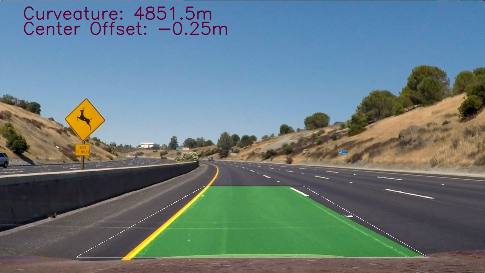

**Advanced Lane Finding Project**

The goals / steps of this project are the following:

* Compute the camera calibration matrix and distortion coefficients given a set of chessboard images.
* Apply a distortion correction to raw images.
* Use color transforms, gradients, magnitude and direcional threashold to create a combined-thresholded binary image.
* Apply a perspective transform to rectify binary image ("birds-eye view").
* Detect lane pixels and fit to find the lane boundary.
* Determine the curvature of the lane and vehicle position with respect to center.
* Warp the detected lane boundaries back onto the original image.
* Output visual display of the lane boundaries and numerical estimation of lane curvature and vehicle position.


## [Rubric](https://review.udacity.com/#!/rubrics/571/view) Points

### Camera Calibration

#### 1. Use the camera to shoot about 20 images of the chessboard pape, then feed all the images to the calibration function.

The code for this step is contained in the "def def calibrate_camera(...)" of the IPython notebook located in "solution.ipynb". I also need to tell the calibration function that the actual number of corners expected -- calibration will not happen if found coners less than half of the checkboard images

I start by preparing "object points", which will be the (x, y, z) coordinates of the chessboard corners in the world. Here I am assuming the chessboard is fixed on the (x, y) plane at z=0, such that the object points are the same for each calibration image.  Thus, `objp` is just a replicated array of coordinates, and `objpoints` will be appended with a copy of it every time I successfully detect all chessboard corners in a test image.  `imgpoints` will be appended with the (x, y) pixel position of each of the corners in the image plane with each successful chessboard detection. Note that we can safely skipt those image that we cannot find correct number of corners from. I have stored all images with correct number of corners found in the directory "./camera_cal_output". Here is one of such an example output:


I then used the output `objpoints` and `imgpoints` to compute the camera calibration and distortion coefficients using the `cv2.calibrateCamera()` function. The main output is camera matrix and undistortion matrix which will be used in the next step.


### Pipeline (single images)

#### 1. Provide an example of a distortion-corrected image.

To demonstrate this step, I will describe how I apply the distortion correction to one of the test images like this one:


#### 2. Use combined gradient and color threshold to detect the candidate lane pixes

I used a combination of gradient, magnitude, directional and color thresholds, to generate a binary image. See the function abs_sobel_thresh(...), dir_threshold(...), mag_thresh(...), color_thresh(...) and eventually the combined_thresh(...) to combine all together.  You can tell how different thresholding mechanism works from the following pictures:

| gradient x axis |  | gradient y axis |   magnitude |
| directional gradient|  Combined all gradient related |  color threshold | 

Below picture shows all combined result:


#### 3. Describe how (and identify where in your code) you performed a perspective transform and provide an example of a transformed image.

Before proceed with 

The code for my perspective transform includes a function called `get_perspective_transform_matrix()`, which appears in the code cell titiled with "Transform perspective" of the IPython notebook.  The function takes "straightline1" test image. 


I chose the hardcode the source and destination points in the following manner:

```python
src = np.float32([[748,490],[1050,678],[262,678],[540,490]])
dst = np.float32([[1042,5],[1042,719],[262,719],[282,5]])
```

This function returns two  M, INVM - the former is used to warp normal camera view to a bird-eye view, while the latter is saved to be used later to warp a bird-eye view back to a normal camera view. the perspective transform was working as seen as below image


#### 4.  Identified lane-line pixels and fit their positions with a polynomial 

As the section 8 in the IPython notebook, I found lane-line pixels by using histogram. The first step we'll take is to split the histogram into two sides, one for each lane line. Then, set up windows and window hyperparameters. Our next step is to set a few hyperparameters related to our sliding windows, and set them up to iterate across the binary activations in the image. Now that we've set up what the windows look like and have a starting point, we'll want to loop for nwindows, with the given window sliding left or right if it finds the mean position of activated pixels within the window to have shifted.


Then, as the section 10 in the IPython notebook, we have found all our pixels belonging to each line through the sliding window method, it's time to fit a 2nd order polynomial to the line.  For now, you have noted the complex code in block 9 of the IPython notebook - they will be described in the video processing section.


#### 5. Calculated the radius of curvature of the lane and the position of the vehicle with respect to center.

I calculated the radius of curvature in lines 152 through 168 in section 9 of the IPython notebook. The curvature is calcuated as a method of class Line, which is used to depict left line and right line of a lane. I assumed that the lane length is 30 meter.

I calcuated the position of the vehicle with respect to center in lines 196 through 213 in section 9 of the IPython notebook. I assumed that the camera is mounted at the center of the car and the deviation of the midpoint of the lane from the center of the image is the offset. I also used common sense assumption that the road width is 3.7meter.  The center position calcuation is a member method of the Lane class. A Lane class mainly has two members - left_line and right_line.

The Line and Lane class mainly kept the state of the lane finding result and will be further discussed in the video processing section.

#### In the end, created the result picture with lane zone visualized over the original picture.

I implemented this step in section 12 of the IPython notebook.  Here is an example of my result on a test image. Please note that the white box is for interest zone experiment I kept in this project. The green zone highlighted is the lane detected.



---

### Pipeline (video)

#### 1. Video processing result
All the processed videos are stored under directory "test_videos_output". Here's a [link to my video result](./test_videos_output/project_video.mp4)

---

### Discussion

#### 1. Briefly discuss any problems / issues you faced in your implementation of this project.  Where will your pipeline likely fail?  What could you do to make it more robust?

As an experiment, I still kept the interst-of-region box to crop out regions of no interst. See function "region_of_interest(...)" in the the section 5 of the IPython notebook. It's very tedious to get the proper box for different corner entering cases and the result is not good at all when enters sharp turns as seen in the harder challenge video. I made effort to adjust the padding based on the left turn or right turn cases but not that effective. Anyway, I see the corner boxing will help a bit to bootstrap the inital lane finding, later on, I see it overlaps with the lane finding optimzation search_around_poly() already implemented in line 91, section 9 of the IPython notebook where we only search for lane pixels in the area with the width of the margin around the previous best fit polynomial lines.

The perspective tranform actually also impacts the result significantly. I spent quite some time to find the proper numbers, especially in find the destination matrix through try-and-error. We need a more rigorous procedure similar to the camera calibration to improve quality and be more time saving. 

Where it may fail? When it comes to the challege video , the current algorithm does not work well when heave shadow, or the curb side wall itself, that are very close to the lane line. Regarding the former, we can improve in the following ways: a) leverage the line paint color, usually in white and yellow, against the heavy shadow or road side strcuture that is in deep concrete grey.  b) don't simpliy pick the 2 peaks from the histogram, we can pick mulitple and then find the pir with close 3.7meter lane width.

Also it does not work every well in the harder challenge video where sharp turns are made. For this one, first we need to drop the interest zone box in those conditions or have a very less restricted box to cover the bottom half of the image; also need to spend time to experiment with the polynomial fitting for very sharp turns. If more time is spent, should be able to tackle those issues.


